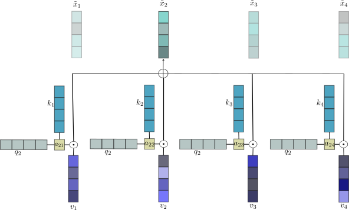
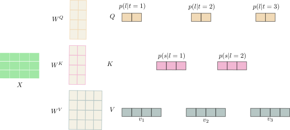

We introduce Latte, a new linear time and memory attention mechanism which, unlike other sparse methods, takes all the tokens into account. Our method can be used as a replace ment of the standard attention in both bidirectional and causal settings with similar empirical performance. An additional benefit of causal Latte is efficient inference, which only requires constant time to predict the next token, compared to the linear scaling requirement of the standard attention.

 We are first going to rewrite the classic attention mechanism in the non-vectorises form, which will help us describe the idea behind Latte more intuitively. 

 ## Quick Recap
 One of the most common ways of writing an attention layer is using the matrix form:
 $$
 Softmax(\frac{1}{\sqrt{d}}QK^T)V
 $$

 Nonetheles, the formula can be written more intuitivel without any vectorisation. Considering a sequence of $T$ tokens from which we obtain the query $q_i$, key $k_i$ and value $v_i$ we can explain attention using the figure below:
 

In the above we defined:
$$
A_{ij} = \frac{\exp(Q_{i,:}K_{:,j}^{T})}{\sum_{j=1}^T \exp(Q_{i,:}K_{:,j}^{T}) }
$$
and
$$
\tilde{x_i} = \sum_{j=1}^T A_{ij}V_j
$$

For the causal case we would simply sum up to $i$ instead of $T$ such that tokens in the future are not considered. 

## Latte Layer
The problem with attention is that computing all $A_{ij}$ is quadratic in sequence length, hence we need to find a more efficient way to summarise the interactions between tokens. One simple approach is to intoduce a few learnable tokens and perform attention only between the introduces tokens and the original sequence. This approach is was succesfully explored by many sparse methods like [BigBird](https://arxiv.org/abs/2007.14062), however in Latte all tokens are considered in the calculation.

*Comparison between Bidirectional Standard attention, sparse attention methods and Bidirectioanl Latte.*

More exactly, we replace each $A_{ij}$ with an approximation based on $L$ learnale latent variables:
$$
A_{ij} = \sum_{l=1}^L Q_{il}K_{lj}
$$  
The new vector representation of each token is given by:
$$
\tilde{x_i} = \sum_{l=1}^L Q_{il} \sum_{j=1}^T K_{lj}V_j
$$
Note that $Q$, $K$ have different sizes than the queries and keys in the standard attention. Figure 3. descirbed in detail how we obtain the matrices.


*Figure 3. Each row in X corresponds to a token in the input sentence. We multiply the input to the corresponding weights of Q,K,V. Note that we exponentiate and normalize both Q and K on rows.*


The approach is motivated by a probabilistic perspective where $A_{ij}$ is interpreted as probability distribution. While in this blog we describe the model at an intuitive level, a more rigurous mathematical explanation can be found in [our paper](https://arxiv.org/abs/2402.17512).

## Causal Latte
In the previous sections we described the bidirectional case, but for problems like language generation we need a causal mechanism. The change can be trivially seen by looking at the formula $\tilde{x}_i$. We only need to consider tokens up until index $i$, and no longer the entire sequence:
$$
\tilde{x_i} = \sum_{l=1}^L Q_{il} \sum_{j=1}^i K_{lj}V_j
$$

This formulation can be implemented using matrix operations, however a sequential implementation has the benefit of small memory and constant time for next token prediction task at inference.

## Results
### Long Range Arena
Long Range Arena os a synthetic benchmark which tests models on long sequences. We implement the tasks with a bidirectional Latte model using 40 latents and obtain good results compared to other transformer models.

| Model | ListOps | Text | Retreival | Image | PathfInder|
|----------------| ---|---|---|--- | --- |
| Latte | 40.18 | 64.5 | 73.39 | 47.55 | 75.61 |
Standard Transformer | 36.37 | 64.27 | 57.46 | 42.44 | 71.40 |
Linformer | 35.70 | 53.94 | 52.27 | 38.56 | 76.34 |
| Luna | 38.01 | 65.74 | 79.55 | 47.47 | 78.89 |

## Language Generation
We train a model on wiki103 dataset and show and example of language generation from a short promt.

Prompt:
```
<s>Homarus gammarus
```
Generation of 100 tokens:
```
<s>Homarus gammarus, the common ancestor of the gray wolf <unk>, has been identified to date to at least the Miocene of northern Chile, from the Lower Peru. Analysis by the researchers has shown the presence of <unk>, <unk>, <unk>, and <unk> <unk> to be a member of the subfamily <unk>, although <unk> et al. ( 2001 ) suggested a species may represent this subspecies. \n fauna includes large mammals, and a few species have been documented in the Pacific island of California. \n mtDNA from Arizona bears the subspecies D. huenei's skull, found across the Pacific Ocean, along with three species of small theropod mongooses. The two species share several distinct forms, both geographically and genetically. The genus name honors the long @-@ established genus <unk>, found in northwestern Argentina. The skull and skull are from the Late Cretaceous of Texas, but not from"
```